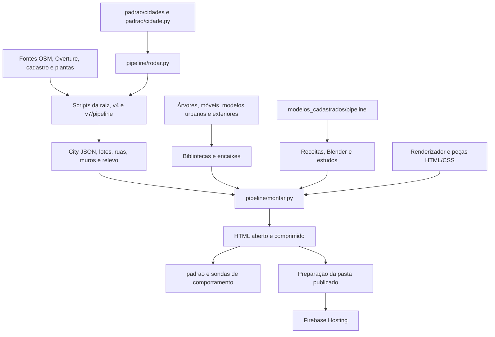

# Plano de modularização da imobiliária

Data: 14/09/2026. Diagnóstico original preservado abaixo. Implementação local autorizada e em andamento; status atualizado em [todo.md](todo.md), evidências em [baseline/README.md](baseline/README.md).
Destino separado autorizado pelo usuário para preservar o plano de ocupação existente.

## Recomendação

Manter um único projeto e separar o código por responsabilidade, com interfaces explícitas e uma montagem reproduzível. O primeiro alvo é `renderizador-v16-moveis/app.js`. Os módulos de desenvolvimento continuam sendo empacotados no HTML de distribuição. A separação não exige servidores, microserviços ou vários repositórios.

O resultado esperado é conseguir alterar busca, móveis, terreno ou cadastro sem percorrer dez mil linhas e sem depender de variáveis privadas de outro subsistema. Separar arquivos é a primeira etapa; remover dependências implícitas é o que efetivamente conclui a modularização.

## Cobertura e limites da varredura inicial

- 10.487 arquivos enumerados por `rg --files --hidden`, excluindo `node_modules`, `.git` e `.firebase`.
- 372 arquivos textuais de código/HTML lidos pelo inventário: 214 classificados como código, 91 HTML/artefatos, 59 históricos/relatórios e 8 bibliotecas. A classificação é por caminho e extensão; os 214 incluem experimentos e scripts antigos, não significam 214 arquivos ativos.
- Extensões encontradas: 191 Python, 126 HTML, 37 JS, 12 MJS, 4 CSS e 2 regras Firebase.
- Análise estrutural por AST nos Python classificados como código, sem erros de sintaxe nessa análise. Imports e funções registrados em `inventario.json`; JS mapeado por expressões regulares, sem grafo semântico completo.
- Leitura dirigida dos pontos de entrada, montador, runner, módulos do renderizador, sondas, configuração de Hosting e documentação dos pipelines. A leitura automática integral não equivale a revisão manual linha por linha.
- Dados JSON/GeoJSON, imagens, Blender, binários e ZIPs foram enumerados, mas não auditados integralmente. Dependências de terceiros não foram revisadas.
- Não foram executados builds, downloads, Blender, publicação ou testes comportamentais. Este documento não atesta que a versão atual passa nos testes.
- O diretório atual não foi reconhecido como repositório Git. A estratégia de reversão precisa ser estabelecida antes da implementação.
- As ferramentas Ruflo/ToolSearch solicitadas nas instruções não estavam disponíveis na lista de ferramentas desta sessão.

## Diagnóstico com evidências

| Ponto | Evidência local | Consequência para a divisão |
|---|---|---|
| Monólito principal | `renderizador-v16-moveis/app.js`: 10.603 linhas, 570.651 bytes | Cena, materiais, terreno, ruas, árvores, streaming, ficha, interiores, móveis, iluminação, busca e loop compartilham uma IIFE |
| Três implementações grandes | `renderizador/app.js`: 9.890 linhas; `renderizador-v16/app.js`: 9.859 | Consolidar diferenças por capacidades; escolher uma cópia sem comparar pode perder funcionalidades |
| Variante ambígua | `pipeline/montar.py:56` define padrão v15; `firebase.json` publica `v16-moveis/publicado` | Tornar cidade, variante e destino explícitos na montagem e QA |
| Dependências incompletas no runner | Etapa 8 em `pipeline/rodar.py:168` declara `renderizador/app.js` e peças antigas | Alterações nos módulos v16-moveis e bibliotecas podem não invalidar a montagem pelo conjunto de entradas declarado |
| Montador com regras de domínio | `pipeline/montar.py:318` chama `compile_placements`; linhas 339–359 montam exteriores e cadastros, com condições de São Carlos | Separar compilação de dados da serialização do HTML |
| QA dependente de texto | `padrao/pagina.py:18` injeta código em âncoras como `function registerTerrain(geo)` | Mover/renomear funções pode tornar medidas indisponíveis; criar interface de diagnóstico antes |
| APIs internas extensas | `app.js:9582` expõe `window.__int`; linha 9608 expõe `window.__perf` | Preservar compatibilidade das sondas enquanto se restringem as interfaces |
| Código antigo ainda necessário | `pipeline/rodar.py` chama `v4/build_city_v4.py` e numerosos scripts de `v7/pipeline` | Pastas com número de versão não podem ser simplesmente arquivadas |
| Duplicação confirmada | 11 grupos de duplicatas textuais normalizadas no inventário | Dez pares de Python e um par de CSS; escolher fonte canônica e manter wrappers temporários |
| Formatos acoplados por índice | `decode`, `bl[]`, `urbanLots` e ocupação dependem da ordem dos registros | Extração precisa preservar índices, quantização, orientação e identificação |
| Saída local e recursos externos | `exterior-details.js:46` busca tiles `.bin` por URL relativa | Embutir o código não garante que todos os detalhes atuais funcionem offline; testar e documentar a disponibilidade por modalidade |
| Publicação dispersa | `pipeline/publicar.py`, `tools/publicar_aberto.py`, `exteriores/v1/preparar.py` | Há estratégias diferentes de nomes, limpeza e hash; centralizar sem apagar versões anteriores |
| Verificação dispersa | `package.json` tem `test` placeholder; existem QA Python e testes MJS específicos | Reaproveitar testes existentes e fornecer comandos claros por domínio |

Os números antigos de tamanho em PADRAO.md e no cabeçalho de montar.py não descrevem mais o tamanho atual do renderizador. O inventário mede os arquivos presentes nesta sessão.

## Fluxo atual



O diagrama descreve relações de arquivos e chamadas. Não significa que todos os produtores estejam cadastrados no runner ou que a publicação imponha automaticamente o QA.

## Estrutura de destino

Criar os módulos dentro dos diretórios atuais primeiro. Os nomes abaixo descrevem o destino lógico; renomear diretórios maiores fica para o final, após resolver consumidores e caminhos.

```text
renderizador-v16-moveis/
  app.js                    # composição e inicialização
  core/                     # configuração, leitura, coordenadas, armazenamento
  scene/                    # cena, câmera, qualidade, loop e diagnóstico
  world/                    # terreno, ruas, edifícios, vegetação, divisas, streaming
  properties/               # unidades, vínculo ao prédio, ficha e modelo cadastrado
  interiors/                # planta, casca, navegação, iluminação e bake
  furniture/                # catálogo, geometrias, editor e persistência
  ui/                       # busca, POIs, minimapa, controles e interface móvel
  styles/                   # base, mapa, ficha, interior e mobile
  lib/                      # dependências atuais preservadas durante a extração
pipeline/
  build/                    # manifesto, blocos de dados, HTML e compressão
  geo/                      # etapas hoje na raiz/v4/v7, migradas gradualmente
  fontes/                   # aquisição existente
  publish/                  # preparação de artefatos e manifesto de publicação
padrao/                     # configuração e regras geográficas existentes
modelos_cadastrados/         # pipeline próprio já parcialmente modular
arvores/ moveis/ modelos_urbanos/ exteriores/  # produtores especializados
tests/                      # adoção gradual; testes antigos continuam disponíveis
```

Não criar todos os diretórios vazios antecipadamente. Cada extração entrega arquivos usados pela aplicação e remove a implementação correspondente de app.js.

## Mapa de extração do renderizador

Referências de linha são pontos de navegação na versão analisada, não fronteiras seguras para cortar texto.

| Destino | Símbolos/localização atual | Interface e cuidado principal |
|---|---|---|
| `core/city-data.js` | `readPath`, `decode`, linha 133 | Receber quantização/configuração; devolver B/R/G/grp sem DOM e sem reordenar |
| `core/geometry.js` | `triangulateRing`, `insetRing`, `obbOf`, linha 1585 | Funções geométricas sem cena; definir tolerâncias e eixos |
| `core/storage.js` | acesso protegido linha 290; móveis linha 7974 | Adaptador que mantém chaves e tolera storage indisponível |
| `world/terrain.js` | `terrainY`, registro e deformação, linha 480 | Dono da grade, caches e registro; notificar mudança e limpar registro no descarte |
| `world/buildings.js` | `buildBuildings`, linha 1925 | Receber materiais/terreno/seleção de modelos; devolver geometria e metadados |
| `world/roads.js` | junções e `buildRibbons`, linha 2444 | Consumir tabela canônica de vias; manter relação asfalto/calçada/lotes |
| `world/vegetation.js` | `buildTrees`, pools e atualização, linha 2724 | Preservar atualização incremental e exclusão de asfalto |
| `world/boundaries.js` | `buildMuros` linha 1181; `refazPortoes` linha 3359 | Mesmo terreno e mesmos lotes para muro, portão e casa |
| `world/streaming.js` | `groupsFrom`, `dropGroup`, `streamPump`, linha 3843 | Dono da fila e grupos; chamar mount/unmount e liberar recursos |
| `properties/` | unidades linha 3716; fichas linhas 4267 e 6413 | Identidade e confirmação separadas da visualização; preservar cadastrados |
| `furniture/geometry.js` | `armarioParam` e famílias, linha 5296 | Receber dimensões/material; não consultar seleção global |
| `furniture/editor.js` | seleção linha 8058; gestos linha 9178 | Comandos de selecionar/mover/girar/redimensionar; salvar pelo adaptador |
| `interiors/floorplan.js` | `paredesDaGrade`, `decideVao`, `plantaDaUnidade`, linha 6520 | Construção da planta com regras explícitas e origem conhecida |
| `interiors/geometry.js` | esquadrias linha 7056; `geoDaCasa` linha 7741 | Geometria separada de bake e interação |
| `interiors/lighting.js`, `bake.js` | bake linha 7279; iluminação linha 8371 | Donos de recursos e estado incremental; manter orçamento por quadro |
| `interiors/navigation.js` | colisão linha 8087; entrada/saída linha 8683 | Transição de câmera, corte e descarte explícitos |
| `ui/` | POIs linha 4673; busca linha 9885; minimapa linha 10081 | Consumir consultas e ações do domínio; evitar alterar a cena diretamente |
| `scene/frame.js` | `frame` linha 10478; governador linha 9792 | Um único requestAnimationFrame; ordem explícita de atualização |

Reaproveitar `TerrainFit`, `RoadClearance`, `UrbanModels`, `ExteriorDetails` e `ListingModels`, que já estão separados. A primeira fase mantém suas APIs; sua conversão para imports explícitos ocorre depois de estabilizar o empacotamento.

## Contratos que precisam existir

1. **Configuração de build:** cidade, variante, origem dos módulos, saídas e dependências. A mesma resolução serve montador, runner, QA e preparação de publicação. Ler configuração não deve interpretar CLI ou carregar cidade por efeito de import.
2. **Dados da cidade:** documentar `q`, `b`, `r`, `g`, `bl`, metadados e `urbanLots`; manter significado e índices. Adicionar testes com amostra pequena, sem redesenhar o formato nesta migração.
3. **Contexto da cena:** passar somente dependências usadas por cada módulo, como THREE, scene, terrain e invalidadores. Evitar um objeto global com todas as variáveis do monólito.
4. **Ciclo de vida:** módulos visuais expõem criação, atualização e descarte. Quem cria listeners, geometria, materiais, filas e caches define como liberá-los. Recursos compartilhados têm um dono.
5. **Diagnóstico:** interface estável para ler cena, executar um passo e medir geometria. Adaptadores preservam `__qa`, `__int` e `__perf` enquanto as sondas migram.
6. **Bibliotecas e cadastros:** entradas explícitas de versão, identificação, medidas, orientação e encaixes. Validar o formato consumido sem mudar o significado dos imóveis existentes.

## Estratégia de empacotamento

Primeiro introduzir um manifesto ordenado de arquivos e concatená-los preservando o escopo atual. Isso permite provar equivalência mecânica e obter reversão simples. Essa etapa é temporária: arquivos separados que ainda compartilham todas as variáveis não satisfazem o aceite final.

Em seguida converter cada domínio para fábrica/API explícita; manter a ordem de inicialização no ponto de composição. Se imports ES forem adotados, adicionar uma etapa de bundle que gere um script clássico embutível no HTML. A seleção da ferramenta fica para a implementação, após verificar compatibilidade com as bibliotecas locais. Não atualizar Three.js ou trocar framework simultaneamente.

Manter HTML aberto, comprimido e hospedado. Validar separadamente recursos embutidos e tiles externos: o modo file:// deve conservar ao menos o comportamento de referência, com limites conhecidos documentados. A navegação offline não pode passar a depender de imports externos por acidente.

## Ordem e entregas

1. **Base de comparação:** inventário de variantes, checkpoint reversível, configuração explícita e manifesto de entradas; registrar fluxos e desempenho atuais.
2. **Primeira extração completa:** API de diagnóstico, composição por manifesto e decodificador puro funcionando na página. Essa entrega prova o método com risco contido.
3. **Mapa externo:** terreno; ruas/edifícios; vegetação/divisas; streaming. A ordem evita extrair a fila antes dos recursos que ela gerencia.
4. **Fluxos do usuário:** ficha/cadastro, busca/POIs/minimapa, móveis e interiores em pequenos lotes. Mover loop/câmera para a composição final quando os consumidores estiverem explícitos.
5. **Build e dados:** separar encaixes e packs do HTML, migrar scripts ainda ativos de v4/v7 e deduplicar plantas com wrappers de compatibilidade.
6. **Consolidação:** CSS, diferenças entre renderizadores, publicação e documentação; arquivar somente caminhos sem consumidores.

A lista executável, com dependências e aceite por tarefa, está em `todo.md`. As fases são marcos; tarefas maiores são repetidas em lotes de até cinco arquivos. Como reserva inicial de planejamento, prever 20–35 sessões focadas, a recalibrar após a primeira extração. Não é prazo fechado: validação visual, dados disponíveis e diferenças entre variantes podem dominar o esforço.

## Verificação durante a implementação

- Baseline em São Carlos v16-moveis, Ribeirão Preto com interior disponível e uma cidade sem bibliotecas opcionais. Confirmar existência dos dados antes de montar.
- Fixar câmera, viewport, qualidade, estado dia/noite e trecho. Medir tempo de quadro, carregamento, memória/objetos e tamanho de saída; comparar na mesma máquina e com controle de repetibilidade.
- Usar `python -m unittest discover -s modelos_cadastrados/pipeline -p "test_*.py"` no pipeline de anúncios quando afetado.
- Usar `python padrao/rodar_qa.py <slug>` com a variante explicitamente selecionada. `--rapido` serve ao ciclo curto, não substitui o comportamento completo.
- Reutilizar `pipeline/testa_*.py`, `pipeline/mede_*.py`, `pipeline/compara_print.py` e testes de `modelos_urbanos/v1/integracao/` conforme o domínio. Confirmar suas opções antes de automatizar chamadas.
- Para extrações puras: amostras que cubram quantização, polígonos, bordas e persistência. Para extrações visuais: fluxo real no navegador e comparação de geometria/imagem.
- `montar.py --conferir` é útil durante extração mecânica; após mudar a organização do JS, comparação textual do HTML deixa de provar equivalência funcional. Comparar dados e comportamento separadamente.
- Medição ausente deve aparecer como ausência, nunca como aprovação. Limites existentes de PADRAO.md continuam válidos; tolerâncias de desempenho novas devem ser baseadas na dispersão medida.

## Riscos e reversão

| Risco | Tratamento |
|---|---|
| Ordem de inicialização e dependência circular | Extrair funções puras primeiro, passar dependências e manter uma composição explícita |
| Mudança de comportamento ao dividir closures | Compatibilidade temporária e teste da fatia imediatamente após a extração |
| Regressão em IDs, índices ou unidades | Comparar dados e vínculo do imóvel antes/depois, sem reordenar |
| Memória cresce ao navegar repetidamente | Exercitar montar/desmontar grupos e entrar/sair de interiores; conferir recursos vivos |
| QA mede outra versão | Configuração única e relatório com cidade, variante e identificação do artefato |
| Cache omite novo módulo | Manifesto inclui módulos, configs, bibliotecas e entradas opcionais relevantes |
| Fontes duplicadas divergem | Deduplicar apenas pares comprovados; comparar semanticamente os demais |
| Scripts dependem da pasta de origem | Migrar em lotes com CLI/wrapper compatível e comparação de saída |

Cada tarefa termina com uma versão utilizável e um checkpoint recuperável. Não alterar simultaneamente a arquitetura e o resultado visual. Uma regressão reverte apenas o último lote, preservando dados de usuário. Não remover históricos, mudar URLs publicadas ou executar deploy como parte deste planejamento.

## Aceite final

- app.js só compõe módulos e inicia a aplicação; buscar uma função por domínio dispensa examinar o arquivo inteiro.
- Módulos possuem entradas e donos de estado claros, sem ciclos ou acesso não documentado ao estado privado de outros módulos.
- Build, QA e publicação concordam sobre cidade/variante/artefato; alterar qualquer fonte pertinente invalida o build.
- Fluxos e limites de PADRAO.md preservados nas cidades representativas, incluindo file:// conforme a referência documentada.
- Scripts ativos de versões antigas têm caminho canônico; cópias históricas deixam de ser fonte de produção.
- O projeto continua gerando os artefatos existentes e preserva os cadastros, a persistência local e as URLs durante a transição.
