# Padrão atual — maquete, planta e visita 3D

Referência aprovada em 23/09/2026: **Monte dos Cedros**, com interior corrigido e conjunto externo iluminado. Esta é a versão padrão do gerador para `monte-dos-cedros-37`. Colinas e Castanheiras continuam com suas versões anteriores; a técnica é a referência para próximas conversões, mas seus mapas ainda não foram calculados.

## Onde está cada coisa

| Parte | Fonte canônica | Resultado |
|---|---|---|
| Página, Three.js r168, arquitetura e móveis aprovados | `padrao-atual/anterior/v2.html` | Template autocontido preservado, não é a publicação final |
| Luz e correções do interior | `padrao-atual/lightmap-v3.js`, `piloto-v3/` | Planta 3D e visita compartilham malhas, UVs e atlas |
| Luz do conjunto externo | `padrao-atual/exterior-v3.js`, `exterior-v3/` | Duas torres, portaria, destaque do 8º andar, alternância bloco/conjunto |
| Miniatura e planta estáticas | `padrao-atual/renders/v3/` | Imagens capturadas do visualizador, não substitutos do modelo |
| Montagem atual | `padrao_atual.py` | HTML online com recursos separados; HTML offline com tudo embutido |
| Publicação | `preparar_publicacao.py`, `firebase.miniaturas.json` | Lista explícita de 20 arquivos em `publicado-atual/` |
| Rastreabilidade | `padrao-atual/release.json`, `publication-hashes.json` | Hash das fontes, identificador da versão e hashes de cada arquivo público |
| Evidência de funcionamento | `padrao-atual/qa/` | Desktop, celular emulado, modos, conjunto, offline e pós-publicação |

O pacote canônico não depende de `experimentos/` nem de um servidor em `127.0.0.1`. Os experimentos são o histórico do desenvolvimento, não a entrada da publicação. Não editar o HTML de saída para manter mudanças: editar as fontes acima e reconstruir.

## Como foi construído

```mermaid
flowchart LR
 A[Modelo e móveis aprovados] --> B[Exportar geometria e materiais]
 B --> C[Corrigir normais e encontros das molduras]
 C --> D[xatlas: UV independente para luz]
 D --> E[Cycles: luz direta e indireta sem albedo]
 E --> F[OIDN RTLightmap]
 F --> G[RGBM binário gzip]
 G --> H[Three.js: mesma cena navegável]
 H --> I[Miniatura, planta e testes]
 I --> J[Montagem com hashes e Firebase]
```



1. O ponto de partida é a arquitetura Blender já existente e o interior da revisão 2. Sofá e cama têm volumes arredondados; madeira, tecido e reboco usam texturas procedurais. A geometria foi exportada do próprio visualizador para que o cálculo incidisse nas superfícies que o usuário vê.
2. No interior, normais inconsistentes foram corrigidas por análise dos lados das paredes e coerência entre faces coplanares. **42 transformações de molduras** foram ajustadas para remover trechos colineares sobrepostos, preservando seu contorno externo. Essa sobreposição causava os blocos pretos no teto.
3. xatlas fornece UVs independentes (`uv1`) e sem sobreposição para iluminação. Não reutilizar UVs de madeira/tecido para esse atlas. `geometry-compact.json` associa cada malha e instância aos vértices e UVs corretos; a aplicação verifica a contagem de vértices.
4. Cycles calcula passes `DIRECT` + `INDIRECT`, com `COLOR` desligado. Interior: 2048², 512 amostras, 84 superfícies, cinco rebotes difusos. Exterior: 4096², 128 amostras, 282 peças exportadas. As peças externas continuam agrupadas em 64 malhas no navegador para preservar as chamadas de desenho.
5. OIDN usa o filtro específico `RTLightmap`. O resultado HDR é codificado em RGBM, alcance 16, enviado como bytes RGBA comprimidos com gzip e carregado em `DataTexture`. O carregamento como imagem WebP foi removido: alguns caminhos gráficos do navegador pré-multiplicam o canal alpha e destroem a precisão do multiplicador. WebP continua apenas como arquivo de inspeção, não como textura entregue. Não ativar mipmaps automáticos sobre os valores RGBM codificados. O shader decodifica `RGB × alpha × 16`, com espaço de cor linear.
6. A cor do material é aplicada no navegador, uma só vez. A contribuição difusa já calculada não recebe uma segunda iluminação ambiente/direta. Reflexos especulares continuam interativos. A base escura externa é um suporte de apresentação, não levantamento do terreno.
7. O bake é estático: mover, girar ou redimensionar móveis desativa o mapa interno e mostra aviso, passando para iluminação dinâmica. Recalcular a luz é necessário para aprovar um novo layout.
8. A câmera permanece livre. Nenhum vídeo é gerado. O resultado é uma maquete ilustrativa, com implantação e dimensões aproximadas, não uma imagem fotográfica ou projeto executivo.

### Regerar a luz

Desde 27/09/2026 o `uv.json` de `piloto-v3/` e de `exterior-v3/` não é versionado. O unwrap o
escreve junto com o `geometry-compact.json`, e o bake o lê. Por isso a luz se refaz nesta ordem:

1. **Unwrap,** num ambiente próprio:
   - `pip install -r requirements-bake.txt`, numa venv;
   - `python unwrap-v3.py` e `python unwrap-exterior.py`, os dois em `padrao-atual/`.

   Com as versões desse arquivo, ele reproduz byte a byte o `geometry-compact.json` versionado.
2. **Bake,** no Blender: `bake-v3.py` e `bake-exterior.py`.
3. **Denoise** (`denoise-v3.py`, `denoise-exterior.py`) e **encode** (`encode_lightmaps.py`).

O export de antes dos reparos, `source-before-normal-repair.json`, também saiu em 27/09.
`repair-bake-normals.py` opera sobre o `source.json` atual, sem guardar nem ler backup.

## Montar e publicar a versão aprovada

Na raiz do repositório:

```powershell
python v1.5/miniaturas/preparar_publicacao.py
python v1.5/miniaturas/qa_padrao_atual.py
& .\node_modules\.bin\firebase.cmd deploy --only hosting --config firebase.miniaturas.json --project imobilaria-deccb --non-interactive
python v1.5/miniaturas/qa_padrao_atual.py https://imobilaria-deccb-miniaturas.web.app
```

O comando usa somente o site `imobilaria-deccb-miniaturas`. **Não usar o `firebase.json` da raiz para este fluxo**: ele aponta para o mapa principal. `publicado-atual/` contém apenas a lista permitida; fontes, DOCXs, QA, cenas de cálculo e históricos ficam fora dela. URLs dos atlas e UVs carregam o hash da versão e têm cache imutável. HTML revalida para receber a versão atual.

Para gerar um único arquivo offline pelo comando habitual:

```powershell
python v1.5/miniaturas/pagina_maquete.py --unidade monte-dos-cedros-37 --saida v1.5/miniaturas/maquete-monte-dos-cedros-37.html
```

Esse comando agora monta o padrão atual. `--geometria-base` é uma saída explícita para investigar/reconstruir a arquitetura original; não é a publicação aprovada. `--mapa` continua podendo definir o destino de “Ver mapa”.

## Recalcular a iluminação

Somente republicar não exige Blender nem recalcular os atlas. Para recalcular, as fontes exportadas, UVs e scripts ficam no pacote canônico. Ferramentas usadas: Blender 4.5.3 LTS portátil com Cycles/OptiX, Python 3.14 com NumPy, Pillow, xatlas 0.0.11 e Playwright; OIDN 2.3.3 portátil. Os scripts de OIDN apontam para `%LOCALAPPDATA%/CodexBlenderStudy/oidn-2.3.3.x64.windows/bin`; ajustar o caminho numa nova máquina.

Ordem, dentro de `padrao-atual/`:

1. Blender: `repair-bake-normals.py`, que restaura o snapshot original para correções repetíveis. Python comum (NumPy): `repair-trim-v3.py` e `repair-jamb-v3.py`, nessa ordem, após a correção de normais.
2. Python: `unwrap-v3.py` e `unwrap-exterior.py`.
3. Blender em background: `bake-v3.py -- 2048` e `bake-exterior.py -- 4096`.
4. Python: `denoise-v3.py`, `denoise-exterior.py`, `encode_lightmaps.py`. Para alterar somente o interior, usar `encode_lightmaps.py piloto-v3`, preservando o exterior.
5. Reconstruir, conferir visualmente e testar antes de publicar. Uma alteração de geometria exige reexportar `source.json`, atualizar o template correspondente e os snapshots de normais; atlas de uma malha não serve automaticamente em outra. A validação de contagem ajuda, mas não substitui comparação visual.

O template congelado documenta a combinação exata de bibliotecas e geometria aprovada. Para outro imóvel, produzir uma nova combinação de template, fontes, UVs, atlas e testes; não copiar os mapas do Cedros. Para alterar preço/dados comerciais sem trocar geometria, atualizar os dados com cuidado no template e reconstruir.

## Portão visual e funcional

- Conferir sala e quarto com a câmera voltada para o teto: molduras sem sobreposição preta e cortinas sem manchas de baixa amostragem.
- Conferir fachada de frente, perspectiva e fundos; uma torre e conjunto inteiro; 8º andar destacado; base e cobertura dentro da miniatura.
- Testar planta 2D, planta 3D, visita, colisões, editor e retorno à maquete. Após mover móvel, confirmar aviso da iluminação dinâmica.
- Conferir desktop, largura de celular, ausência de erros e recursos 404, deep links e arquivo offline por `file://`.
- Medir o custo completo: HTML + UVs + atlas usados no modo. O mapa externo binário tem cerca de 7,03 MB transferidos e ocupa 67,1 MB RGBA8 na GPU; compressão de rede não reduz essa alocação. O interior usa atlas separado de 2048², com cerca de 6,39 MB no gzip. Abrir os dois modos mantém ambos na memória.
- Não anunciar fotorealismo, desempenho em celular físico ou atualizações automáticas de luz sem evidência.

## Reversão e histórico

`rollback-2026-09-23/` guarda os arquivos locais anteriores à promoção; `legacy-live.json` registra hashes comparados com o site antes do deploy. Colinas, Castanheiras e os downloads GLB/Blender foram conferidos byte a byte. Esses downloads do Cedros são identificados como **modelo base sem a luz da visita**; o artefato completo para uso offline é o HTML.

No Firebase Hosting, reverter para a release anterior no histórico do site das miniaturas. Depois alinhar fontes/configuração com o snapshot escolhido antes de uma nova publicação. Referências oficiais: [deploy de Hosting](https://firebase.google.com/docs/hosting/test-preview-deploy) e [histórico e rollback](https://firebase.google.com/docs/hosting/manage-hosting-resources).


### Regressão: faixas de quantização no navegador

Executar `python v1.5/miniaturas/qa_lightmap_bytes.py` antes da publicação e depois com a URL pública. O teste lê de volta amostras da GPU e compara com os bytes originais, incluindo multiplicadores alpha baixos, em renderização nativa e SwiftShader. Cabeçalho binário: largura e altura uint32 little-endian; depois RGBA8 RGBM, linhas de baixo para cima. Descompactação com `DecompressionStream`, sem Image, Canvas ou tratamento de transparência. Não corrigir esse defeito aumentando brilho, borrando a cena ou escondendo-o com dithering.


### Edição de móveis: invalidação do bake

O editor reconstrói objetos ao mover/redimensionar: comparar apenas transformações do objeto antigo não detecta a edição. A invalidação deve comparar também identidade e quantidade dos filhos `userData.movel`. Ao substituir, adicionar ou remover móvel, zerar `lightMapIntensity` em todos os materiais assados e reativar a iluminação dinâmica. Teste de regressão: `python v1.5/miniaturas/qa_editor_sombra.py` (ou com URL pública). O teste usa eventos reais de ponteiro, verifica a substituição do sofá, ausência de mapas ativos e transição para a visita.


### Interruptores e iluminação dinâmica interna

`padrao-atual/interruptores.js` adiciona um painel acessível com seis interruptores por cômodo, na planta e na visita. A primeira alteração desativa o bake estático e usa spots nas luminárias, com sombras 1024²; o difusor muda de cor ao apagar. A luz direcional exterior fica zerada no interior dinâmico, evitando vazamento pelo corte da planta ou teto. O teto passa a projetar sombras, exceto os difusores. Há apenas preenchimento ambiente discreto; o modo dinâmico não simula sol direto pelas janelas nem recalcula luz indireta. O estado é mantido durante a sessão e nas trocas de modo. Testar `qa_interruptores.py` e `qa_editor_sombra.py` local e contra o site público.

### Encontros dos batentes e custo em celulares

`repair-jamb-v3.py` encurta 18 montantes até a face inferior de suas nove travessas. Antes, as peças se sobrepunham por 30–55 mm: faces coincidentes com UVs diferentes produziam manchas pretas no topo das portas. Preserva a ordem dos vértices; `correctedPosition` no compacto aplica a mesma correção no navegador e no Cycles. O atlas interno foi recalculado em 2048²/512 amostras e tratado com OIDN. Não reutilizar o mapa antigo após corrigir a geometria. O script é idempotente; conferir os enquadramentos em `qa/jamb-fixed-*` e `qa/corner-fixed-*`.

As seis luminárias conservam sombras 1024², mas `shadow.autoUpdate=false`. Invalidar ao mudar identidade/posição/rotação/escala dos móveis, modo de visualização, interruptores ou restaurar o contexto WebGL. Caminhar ou girar a câmera não invalida os mapas. No interior, desativar também `castShadow` das luzes direcionais: intensidade zero sozinha ainda gera passes no Three.js. Restaurar seus valores originais ao voltar à maquete.

Em telas móveis/touch, DPR limitado a 1,25 (antes 1,75): até **49% menos pixels** no buffer, sem alterar a geometria ou os atlas. O texto/interface conserva a resolução CSS. O atlas interno atual transfere 6.370.900 bytes gzip e aloca 16 MiB RGBA8; a mudança não reduz o atlas externo de 64 MiB nem o custo de carregar ambos os modos.

`qa_juntas_desempenho.py` mede chamadas reais de desenho de sombra via `onBeforeShadow`: zero durante navegação/repouso; 382 chamadas na atualização após mover um objeto no cenário testado. Reativar temporariamente o comportamento anterior produziu 11.842 chamadas em 500 ms na mesma máquina. Esses números são instrumentação de trabalho evitado, **não FPS de celulares físicos**. Emulação touch 390×844/DPR 3 confirmou DPR efetivo 1,25, invalidação das sombras e ausência de erros. Executar local e com a URL pública. Medições ficam em `qa/juntas-desempenho-*.json`.
